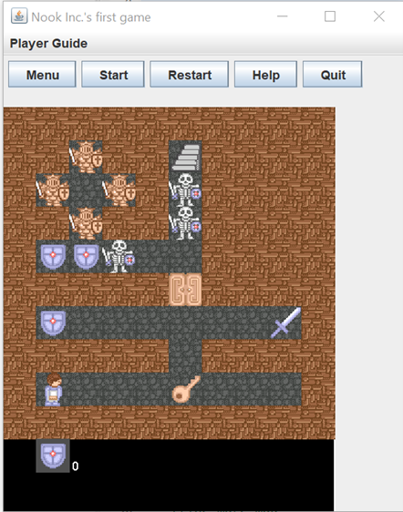
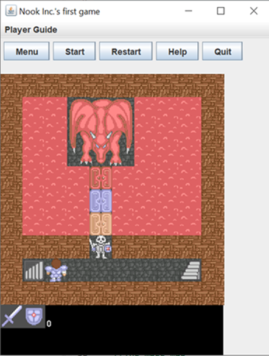
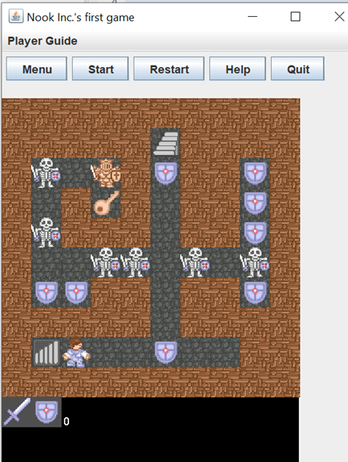
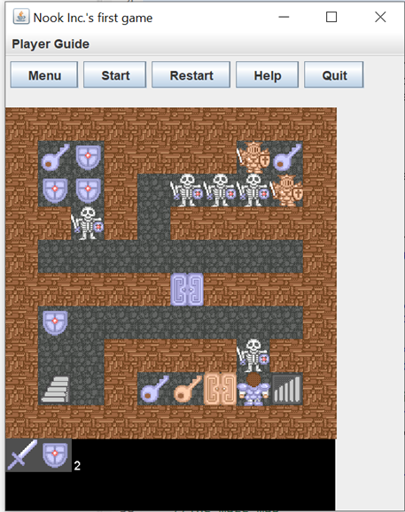
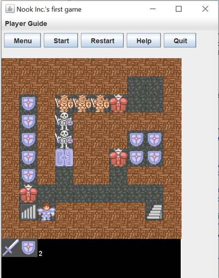
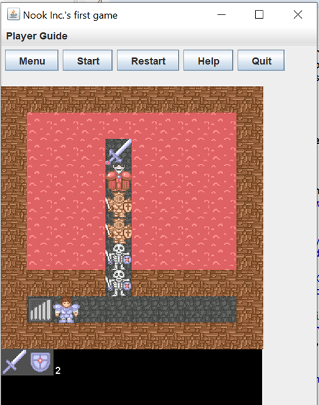

# Magic-Tower

This is the first maze game designed and modified by the group 'Nook Inc.' The main theme of the game is for the knight to enter a six-level tower and rescue the princess, while facing monsters and a red dragon. The knight can pick up a sword and shield to defeat the monsters, and ultimately obtain the master sword to defeat the red dragon and rescue the princess.

We were inspired by the Nintendo Switch game 'The Legend of Zelda: Breath of the Wild', which forms the basis of our idea - the knight picks up weapons to defeat monsters, and the weapons are spent during the game. We designed different mazes for each level of the tower, with each maze containing certain weapons, monsters, doors, keys, and hidden items, so that the player can explore the tower to collect these items and ultimately reach the princess. The player can control the knight to defeat monsters, pick up weapons, and obtain keys to open doors. However, the player may get stuck in certain situations, such as when the knight has no shield to protect himself from monsters or no right keys to open doors. In such cases, the player can restart the game.

We used an open-source maze game called 'Tower of the Sorcerer' from Japan, available at https://web.archive.org/web/20171201030605/http://wwajp.com/mtower/. We used its sprites to display our game and looped its background music.

As for scoring, our design idea is to record how long the player takes to defeat the red dragon and rescue the princess. The player can score higher by winning the game quickly. Additionally, the player can save some shields to earn extra points.

Please find attached some screenshots of the game:

At the top of the frame, the 'Player Guide' describes the rules of the game and provides hints to players on how to win. There are five buttons, each with different features, such as returning to the main page, restarting the game, or quitting the game. In the middle of the panel is the main body of the game, with a maze from each level of the tower. The player moves the knight through the maze using the four arrow keys on the keyboard and presses the 'X' key to defeat monsters or open doors. At the bottom of the panel, the items collected by the player are displayed with their icons.

My groupmate and me are both fans of 'Zelda', which inspired the main scheme of the game. We split most of the work evenly, including developing most of the program's functions, optimizing the code, designing the maps, debugging, and writing comments. Both of us handled most of the character movement features and character and monster animations, and was responsible for most of the map design and variable updates. We did not separate the work clearly, and we modified the code for each other, so the program was nicely finished by our team. It was a wonderful team effort.

Additionally, we copied some functions and classes from GameEngine.java because we did not fully understand how to use it as a game engine, but we needed to use some of its features. We have written comments in our Java file where we pasted these codes."
